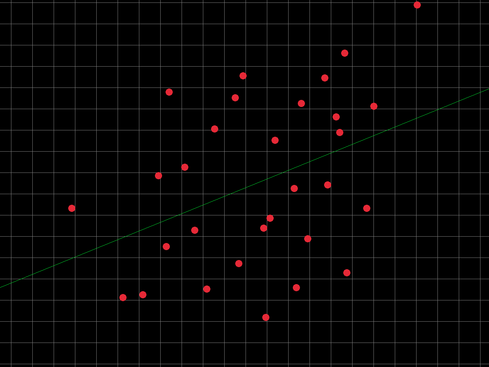
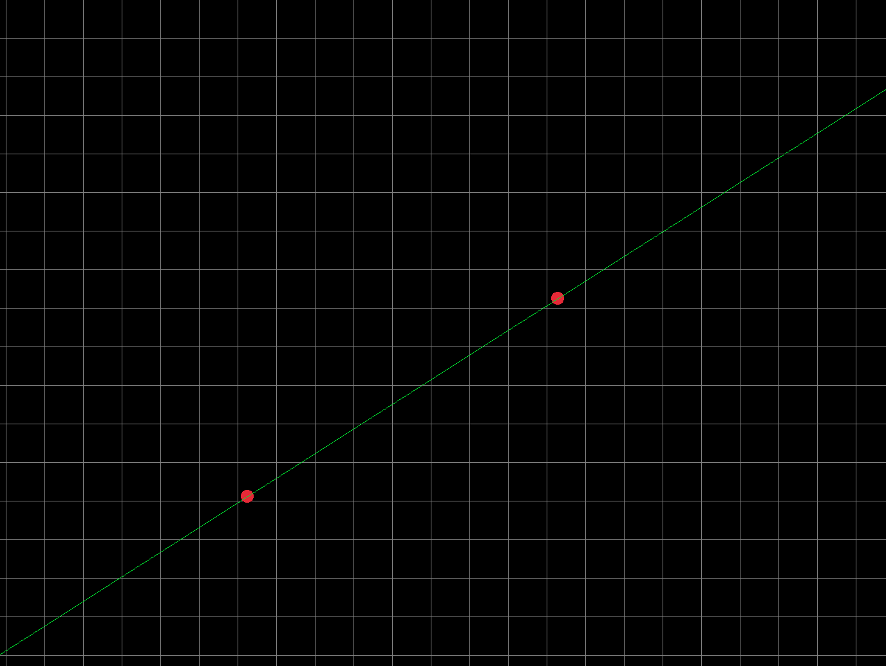

# Graph Regression Visualizer

A small C project that opens a window, lets you click to place points on a graph, and draws a regression line. It uses the 'least squares algorithm' to draw the line. 



## Features

- Opens a 900x900 window with a grid
- Adds points with left mouse clicks
- Draws a line through exactly 2 points using simple slope/intercept
- Draws a least-squares regression line for 3 or more points

## Prerequisites

This project expects raylib to be installed and available at:

- `/usr/local/opt/raylib/include`
- `/usr/local/opt/raylib/lib`

This program is built on MacOs, but it should be able to run cross-
platform. However, I do not believe you would be able to use the make file
due to the neccessity of different flags on different platforms.

## Build and Run

From the project directory:

```bash
make
make run
```

## Controls

- Left click: add a point
- Close window (or system shortcut): exit program

## Notes

- Maximum stored points: 30
- For exactly 2 points, the line is computed from those two points directly



- For more than 2 points, the program uses least-squares regression (See top)

## Future Improvements

- Better UI and visuals
- CSV import
- Multivariable regression
